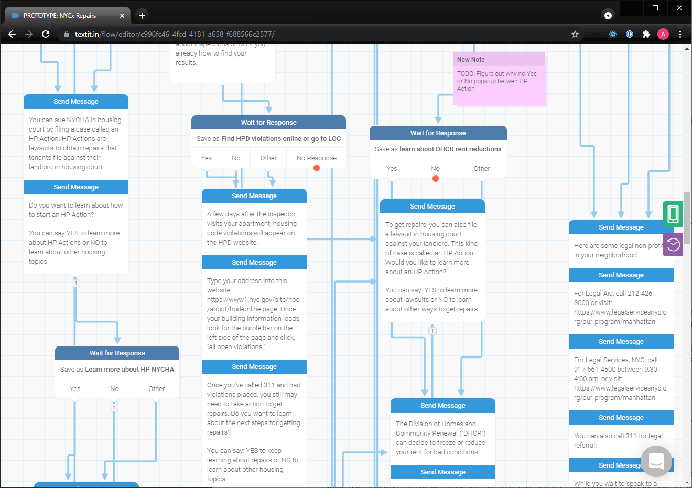
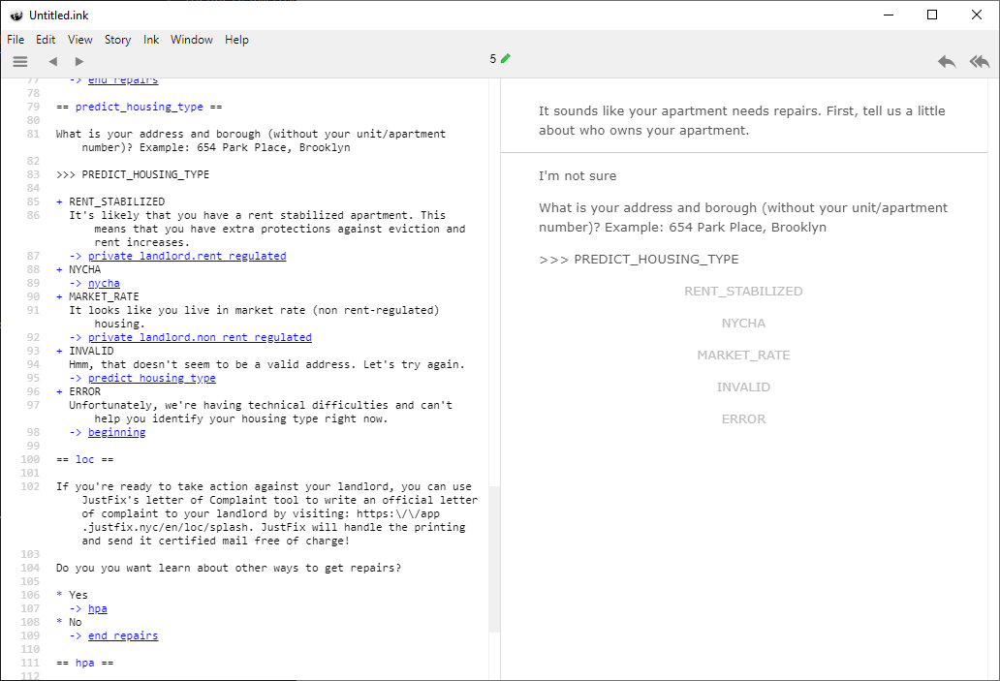

This is an attempt to model a chatbot--specifically, [JustFix.nyc][]'s prototype [NYCx Co-Labs: Housing Rights Challenge][nycx] chatbot--using Inkle's [Ink][] narrative scripting language.

[JustFix.nyc]: https://justfix.nyc
[nycx]: https://www1.nyc.gov/html/nycx/housingchallenge/challenge
[Ink]: https://www.inklestudios.com/ink/

## The problem

Using [TextIt][], a visual no-code platform, for prototyping our NYCx chatbot has proven to be a challenge for our non-technical users for a few reasons:

* Once a conversation becomes slightly complex, it becomes difficult to follow the lines of the flowchart to determine how a flow works. For example, here's a screenshot of part of the TextIt version of the NYCx flow at the time of this writing:

  

* While creating sub-flows is an option to reduce conversational complexity, it has limitations:
  * It's still hard to link to a specific point within a sub-flow.
  * It's difficult to "refactor" an existing, complex flow into smaller sub-flows.

* We're not sure exactly when or how it happens, but TextIt appears to occasionally re-organize the positioning of boxes in visual flows without the user's consent. For example, a flow with boxes that were carefully positioned to not include overlapping lines may one day appear to have suddenly re-organized itself to be much more confusing.  A post-it note carefully positioned next to a box that explains some context surrounding it may suddenly appear in a completely different place in a subsequent page load.  Not only is this confusing, it's also unhelpful for preserving one's sense of spatial navigation as the flow evolves.

* It's difficult to make changes to the flow that affect many conversation points at once. For example, what if we wanted to provide a "go back" option that allowed the user to "rewind" the conversation at any step in the flow?  This would be very cumbersome to do in TextIt, and would significantly affect the visual complexity of the flow.

## A proposed solution

One solution to these issues is moving the entire flow from TextIt to a full-on programming language. This was explored in [JustFixNYC/textit-webhook-fun][], but it greatly increases the barrier to entry for non-technical users to change the flow.  It also isn't particularly easy to understand, because the flow of control in a computer program whose state needs to be serializable doesn't necessarily represent the actual structure of a conversation very well.

Another option that keeps the barrier to entry low while still addressing TextIt's limitations is to use the _Ink_ narrative scripting language.

_Ink_ was originally created for non-technical writers to author interactive narrative. The idea is roughly that plain text is actually an ideal medium in which to write an interactive story. For example, in the 2017 GDC Talk [Creating Interactive Film Scripts for 3D Adventures with Ink][gdc], at [5:23](https://youtu.be/3eYHtDGOM8U?t=323) Inkle's Joseph Humfrey describes how film scripts are used to communicate not only dialogue and narration, but also instructions on how a scene is structured and cut together in a final edit. In a similar way, Ink aims to make it easy for writers with non-technical backgrounds to create interactive narratives.

Also important to note is that Ink's approach actually scales: it's been used to create huge, novel-length interactive narratives like [80 Days][], which suggests that it can retain its readability as a narrative grows in size (rather than turning into a pile of confusing spaghetti).

From an engineering perspective, Ink is actually independent of any particular delivery mechanism or "framework".  It makes no assumptions about whether it's being used in a web-based _Choose Your Own Adventure_ game, an interactive movie, a first-person shooter, or something else entirely.  Furthermore, its API is quite powerful and flexible.  All of this makes it potentially useful for making chatbots.

This project is an exploration of this possibility.

[80 Days]: https://www.inklestudios.com/80days/
[gdc]: https://youtu.be/3eYHtDGOM8U
[TextIt]: https://textit.com/

## Limitations with this approach

* This prototype doesn't address localization at all. Note that a [medium post about Localization][l10n] seems to indicate that Ink doesn't have any built-in support for it, so we're on our own here. 

  One option is to make some kind of preprocessor that extracts strings for localization, similar to gettext; another is to take the Wikipedia approach and simply use a separate file for each locale. Other approaches may exist too.

* Ink doesn't have a concept of free text input--only distinct choices that the user can choose from. This deviates from our current medium of SMS messaging. However, this isn't necessarily a bad thing; see the [What about free text input?](#what-about-free-text-input) section below for more analysis.

  At the time of this writing, the prototype just prints a numbered list of choices and asks the user to pick one, like an old-school phone IVR system. This might actually be ideal for some kinds of choices as it frees the user from having to type long words like "harassment".

[l10n]: https://johnnemann.medium.com/localizing-ink-with-unity-42a4cf3590f3

## Observations so far

We've used [Priority Guides][] in the past at JustFix, but a downside of them is that, because they don't produce a live, functioning system, they quickly become out-of-sync with the actual product. Also, the guides are static text, which makes it difficult to simulate what an actual user would go through.

Ink's writer-driven approach makes it feel like creating a priority guide that's interactive, and which could potentially even be used in production, thanks to Ink's flexible API.  The fact that it forces all decision paths to be enumerated, while keeping the details of implementation decoupled from the flow logic, means that writers can easily simulate all possible conditions without necessarily needing to know exactly what needs to be done in order to trigger them.

Here's an example.  At the time of this writing, this is the Ink source for predicting a user's housing type:

```
What is your address and borough (without your unit/apartment number)? Example: 654 Park Place, Brooklyn

>>> PREDICT_HOUSING_TYPE

+ RENT_STABILIZED
  It's likely that you have a rent stabilized apartment. This means that you have extra protections against eviction and rent increases.
  -> private_landlord.rent_regulated
+ NYCHA
  -> nycha
+ MARKET_RATE
  It looks like you live in market rate (non rent-regulated) housing.
  -> private_landlord.non_rent_regulated
+ INVALID
  Hmm, that doesn't seem to be a valid address. Let's try again.
  -> predict_housing_type
+ ERROR
  Unfortunately, we're having technical difficulties and can't help you identify your housing type right now.
  -> beginning
```

Here the text `>>> PREDICT_HOUSING_TYPE` is a special instruction that we--not Ink--process in [`fun.ts`](fun.ts) to actually take free-text user input and pass it to an API, and use the API result to drive the conversation.

However, while the writer is authoring the experience in Inky--the interactive editor for Ink--all they'll see are the possible outcomes of that process, each of which can be clicked on (Inky presents them as though they're just conversation options):



While at first this seems like a downside, since the author can't freely input text like a user would, it actually has a number of advantages:

* It's clear to the writer what all the possible outcomes are. In contrast, if the writer was presented with the same free-text input a user is presented with, they might not even know that some choices exist, and as a result they will not know that they need to design for them.

* It's straightforward for the writer to ensure that unusual edge cases are handled gracefully from a conversational design perspective.  For example, the case in which a network error occurs is a click away, and doesn't require the writer to set up infrastructure to actually simulate the edge case themselves.

Needless to say, this approach also potentially simplifies testing, since all external dependencies are mocked out by default. What's particularly exciting is also that, at least in the context of Inkle's own development process, _writers_ can drive this process, or at least have a strong voice in it: they can write out whatever conventions feel natural to them, and engineers can parse and interpret those conventions to make those wishes reality.  This echoes the design of systems like Markdown, whose conventions were derived from looking at how people encoded rich-text concepts into plain-text emails.

[Priority Guides]: https://alistapart.com/article/priority-guides-a-content-first-alternative-to-wireframes/

## What about free-text input?

It should be noted that _Ink_'s design has a concept of discrete choices, while SMS-based chatbots need to respond to arbitrary user input.

For a few reasons, this could be considered a _feature_ rather than a bug:

* **It encourages a separation of concerns.** When writers are writing, they should really only have to worry about the choices a user has, rather than _how_ the user is making those choices.  The minute details of text parsing--for example, whether to interpret "yup" as the same thing as "yes"--is not really something the writer should _need_ to worry about. (That said, we can always support the use of [tags][] and other _Ink_ features to allow writers to provide "hints" about how to map user input to choices, too--there are no absolutes here!)

* **It becomes easy to offer the chatbot in a variety of different media.** Because the _Ink_ script is independent of the minutiae of choice selection, this allows us, for example, to deliver the chatbot as both an SMS bot _and_ as a richer web-based experience, in which the user can click on choices instead of writing text.

* **It's easy to experiment with different ways of presenting the user with choices.**  At the time of this writing, the SMS and console-based versions of the chatbot simply display a numbered list of choices, and require the user to respond with a number. But it's quite easy to change this to e.g. require the user to respond with the first letter of each choice (e.g. "Respond with 'y' for yes or 'n' for no"), or something else entirely.  This would be extremely cumbersome in TextIt, since it would require us to manually change the logic of every single "wait for response" block.

[tags]: https://github.com/inkle/ink/blob/master/Documentation/WritingWithInk.md#tags

## Running this prototype

### Prerequisites

- Download the [latest release of ink](https://github.com/inkle/ink/releases) and put it on your `PATH` (i.e., you should be able to run `inklecate` from the terminal).
- You will also need [node](https://nodejs.org) and [yarn](https://yarnpkg.com/getting-started/install).

### Quick start

In one terminal, run:

```
yarn
yarn watch
```

This will set up the TypeScript transpiler to rebuild your code whenever you change it. (If you'd rather not do that, you can run `yarn build` to just build the source once.)

You will then need to open a new terminal to actually run the code.

#### Trying the chatbot in the terminal

To run the chatbot in the console, run:

```
node fun.js
```

#### Using the chatbot via SMS

You can also start a [Twilio Webhook][] server that can integrate with Twilio to serve the chatbot over SMS.

To start it, run:

```
node server.js
```

You will then need to expose port 3000 of your system to the internet (consider using a tool like [ngrok][]) and configure Twilio to send a `POST` to the `/sms` path of your server whenever a message comes in.

Alternatively, you can test the server out locally with curl, e.g.:

```
curl -d "Body=hi&From=%2B15551234567" http://localhost:3000/sms
```

Note that at the time of this writing, the server is intended for demonstration purposes only. It shouldn't be used in production, as it has scaling and security issues.

[ngrok]: https://ngrok.com/

#### Converting TextIt flows to Ink

You can also try converting an existing TextIt flow to Ink with:

```
node import-from-textit/index.js
```

[Twilio Webhook]: https://www.twilio.com/docs/usage/webhooks

## Related projects

- [JustFixNYC/textit-webhook-fun][] is a 2020 experiment to model a TextIt/RapidPro flow as a finite state machine in TypeScript.

- [toolness/justfix-interview-ts-fun](https://github.com/toolness/justfix-interview-ts-fun) is a 2018 experiment to build a conversational system that could work across many different media including SMS and web.

[JustFixNYC/textit-webhook-fun]: https://github.com/JustFixNYC/textit-webhook-fun

## Ink resources

- [Writing web-based interactive fiction with ink](https://www.inklestudios.com/ink/web-tutorial/) is a beginner-friendly tutorial that introduces _Ink_ to non-technical audiences. Not only does it teach the basics of _Ink_, but it also explains how to use _Inky_ to try out one's script and export it to the web for sharing.

- [Writing with ink](https://github.com/inkle/ink/blob/master/Documentation/WritingWithInk.md) is a more in-depth guide that explains all the advanced features of _Ink_.

- [Ink's `documentation` directory](https://github.com/inkle/ink/tree/master/Documentation), located in their primary code repository, contains documents about the internal workings of _Ink_.

